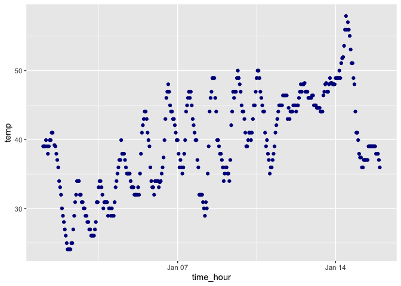

redo_p8105_hw1_wch2124
================
2023-09-21

## problem 1

``` r
library(tidyverse)
```

    ## ── Attaching core tidyverse packages ──────────────────────── tidyverse 2.0.0 ──
    ## ✔ dplyr     1.1.3     ✔ readr     2.1.4
    ## ✔ forcats   1.0.0     ✔ stringr   1.5.0
    ## ✔ ggplot2   3.4.3     ✔ tibble    3.2.1
    ## ✔ lubridate 1.9.2     ✔ tidyr     1.3.0
    ## ✔ purrr     1.0.2     
    ## ── Conflicts ────────────────────────────────────────── tidyverse_conflicts() ──
    ## ✖ dplyr::filter() masks stats::filter()
    ## ✖ dplyr::lag()    masks stats::lag()
    ## ℹ Use the conflicted package (<http://conflicted.r-lib.org/>) to force all conflicts to become errors

``` r
library(moderndive)
data("early_january_weather")
nrow(early_january_weather)
```

    ## [1] 358

``` r
ncol(early_january_weather)
```

    ## [1] 15

``` r
mean(pull(early_january_weather, temp))
```

    ## [1] 39.58212

The variables are the characteristics of the weather in January in 2013,
including hour, temperature, humidity, wind, precipitation, and
visibility. It has 358 rows and 15 columns, with a mean temperature of
39.58212.

``` r
ggplot(early_january_weather, aes(x = time_hour, y = temp, color = humid)) + geom_point(color='darkblue')
```

<!-- -->

``` r
ggsave("p8105_hw1_wch2124.pdf")
```

    ## Saving 7 x 5 in image

The scatter plot shows that temperature overall increases over the
course of the month of January.

## problem 2

``` r
my_df = 
  tibble(
  vec_numeric = rnorm(10),
  vec_char = c(1, 2, 3, 4, 5, 6, 7, 8, 9, 10),
  vec_factor = factor(c("LOW", "HIGH", "LOW", "MEDIUM", "LOW","MEDIUM", "LOW", "MEDIUM", "MEDIUM", "LOW" )),
  vec_logical = vec_numeric > 0 
)
my_df
```

    ## # A tibble: 10 × 4
    ##    vec_numeric vec_char vec_factor vec_logical
    ##          <dbl>    <dbl> <fct>      <lgl>      
    ##  1      0.186         1 LOW        TRUE       
    ##  2      1.87          2 HIGH       TRUE       
    ##  3      1.53          3 LOW        TRUE       
    ##  4     -0.673         4 MEDIUM     FALSE      
    ##  5      2.00          5 LOW        TRUE       
    ##  6      0.990         6 MEDIUM     TRUE       
    ##  7      1.59          7 LOW        TRUE       
    ##  8     -1.64          8 MEDIUM     FALSE      
    ##  9      0.0353        9 MEDIUM     TRUE       
    ## 10      1.59         10 LOW        TRUE

``` r
mean(pull(my_df))
```

    ## [1] 0.8

the mean() function on its own does not find the mean of the data frame,
but when you add the ‘pull’ function, it computes the mean to be 5.5

``` r
as.numeric(my_df$vec_factor)
```

the as.numeric function produced numerical values in place of my factor
levels. this explains why we needed to use the ‘pull’ function to find
the mean because it returns a column as a vector.
